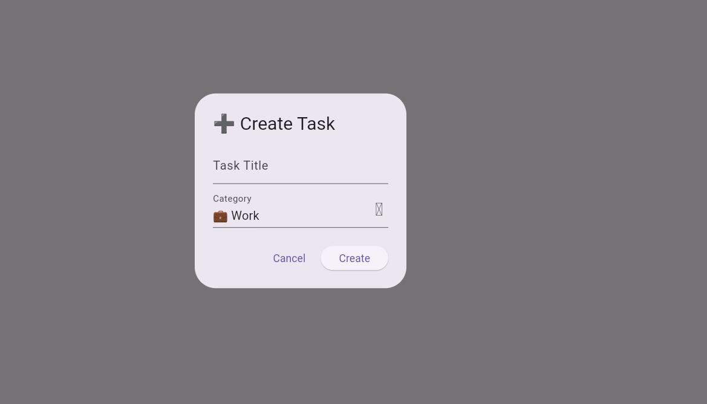
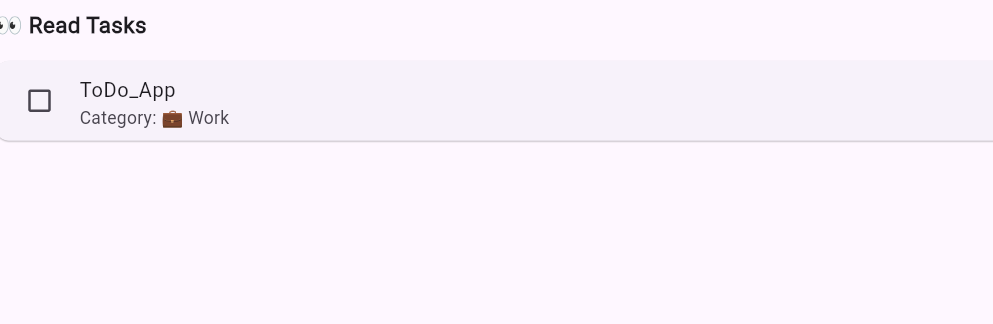
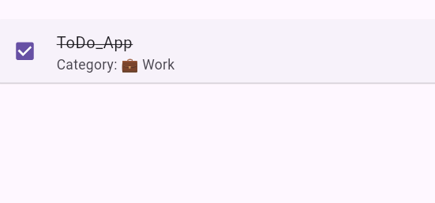

# 📌 CodeClause Internship - ToDo App with Categories (Flutter)

## 📖 Project Overview
A clean Flutter ToDo application with full **CRUD** (Create, Read, Update, Delete), task **categories** (Work, Study, Personal, Health, Ideas), **mark done ✔**, **filter by category**, and **persistent storage** using `shared_preferences`.  

No Firebase required. Runs on **Android**, **Web (Chrome)**, and **Windows**.  

Developed as part of my **Android Development Internship with CodeClause (August 2025)**.  

---

## ✨ Features
- ➕ **Create** new tasks with a category  
- 👁️ **Read** tasks with category filter (All / Work / Study / Personal / Health / Ideas)  
- ✏️ **Update** task title & category  
- 🗑️ **Delete** tasks  
- ✅ **Mark done/undone** with a checkbox  
- 💾 **Persistent storage** (saved locally via `shared_preferences`)  
- 🧪 **Unit/widget tests** included (`flutter test`)  

---

## 📦 Tech Stack
- **Framework:** Flutter  
- **Language:** Dart  
- **Storage:** shared_preferences (local key-value storage)  
- **UI:** Material Design  

---

## 📸 Screenshots
| Create Task | Read Task | Completed Task |
|-------------|-----------|----------------|
|  |  |  |


## 🚀 Getting Started

### 1) Clone Repository
```bash
git clone https://github.com/mk473-code/CodeClauseInternship_ToDoApp.git
cd CodeClauseInternship_ToDoApp


run: flutter run -d chrome
